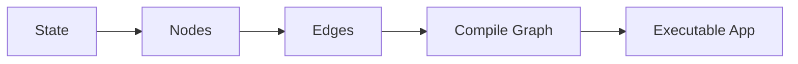
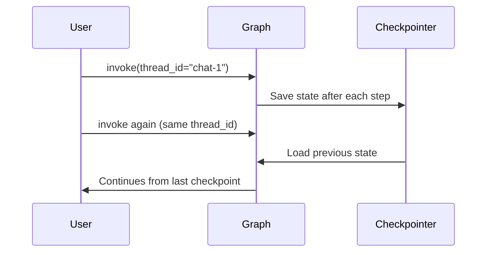
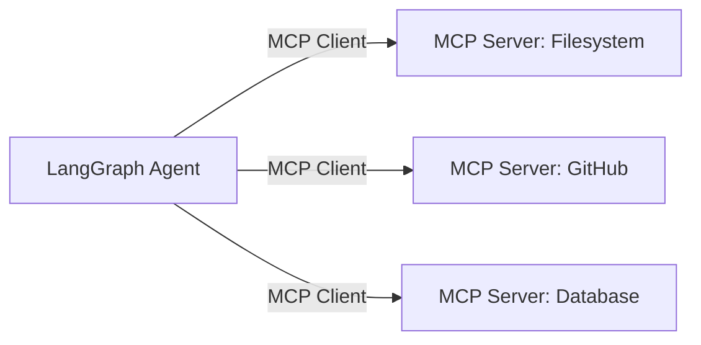
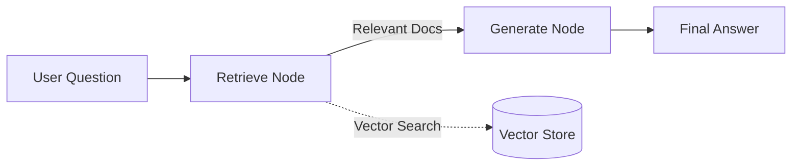
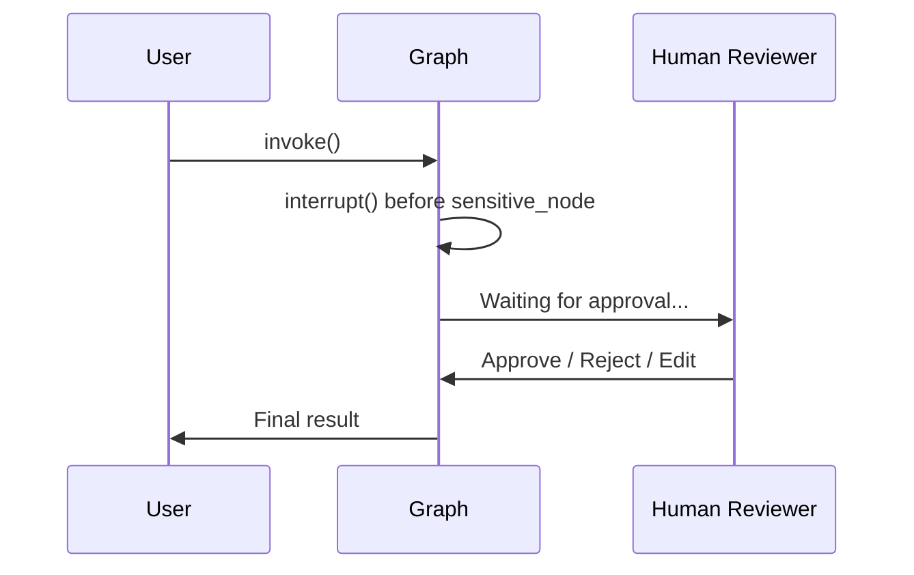
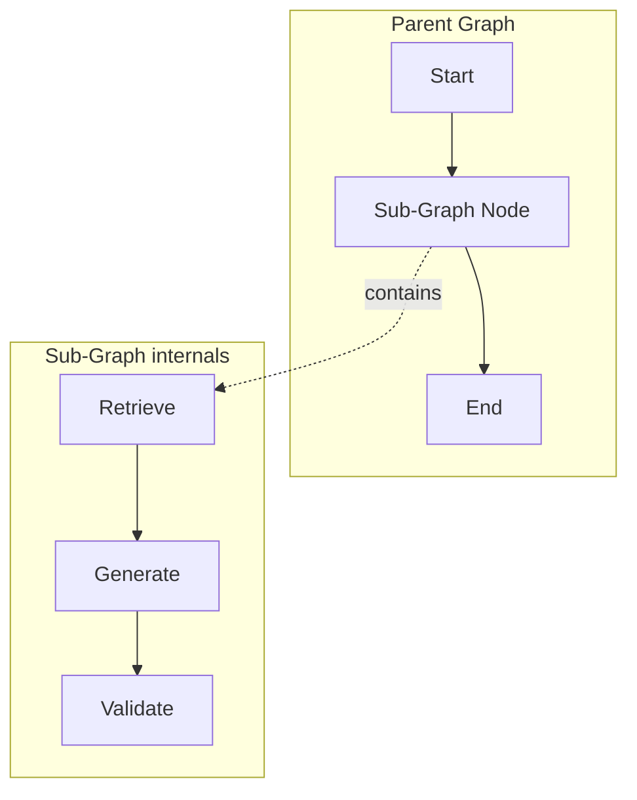
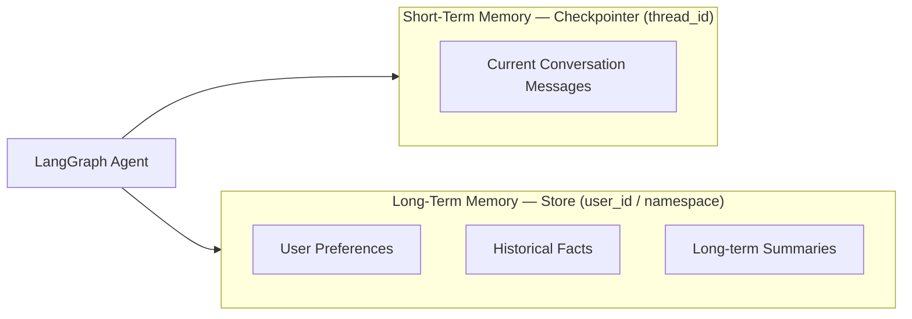
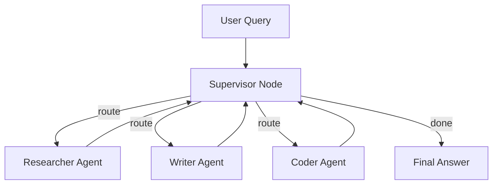
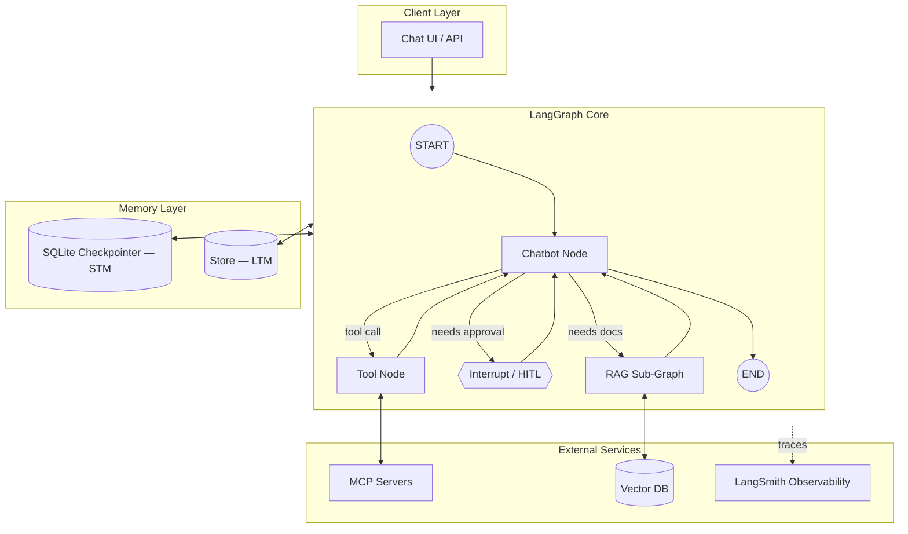

  <div align="center">

# LangGraph — The Complete End-to-End Guide

**From basics to production: Chatbots, Persistence, Streaming, RAG, Agents, MCP, HITL, Sub-Graphs & Memory**

[](https://langchain-ai.github.io/langgraph/)
[](https://www.python.org/)
[](https://www.langchain.com/)
[](https://smith.langchain.com/)
[](https://www.sqlite.org/)
[](#)

</div>

<br>

## Table of Contents

1. [Introduction](#1-introduction)
2. [Installation & Setup](#2-installation--setup)
3. [Core Concepts](#3-core-concepts)
4. [Types of Graphs](#4-types-of-graphs-in-langgraph)
5. [Basic Workflow Example](#5-basic-workflow-example)
6. [Building a Chatbot](#6-building-a-basic-chatbot)
7. [Persistence (Checkpointing)](#7-persistence-in-langgraph)
8. [Streaming](#8-streaming-in-langgraph)
9. [Resuming a Chatbot Session](#9-resuming-a-chatbot-session)
10. [LangGraph + SQLite](#10-langgraph--sqlite-persistence)
11. [LangSmith & Observability](#11-langsmith--observability)
12. [Tools in LangGraph](#12-tools-in-langgraph)
13. [MCP (Model Context Protocol)](#13-mcp-model-context-protocol-with-langgraph)
14. [RAG using LangGraph](#14-rag-retrieval-augmented-generation-using-langgraph)
15. [HITL — Human In The Loop](#15-hitl--human-in-the-loop)
16. [Sub-Graphs](#16-sub-graphs)
17. [STM vs LTM (Memory)](#17-stm-vs-ltm-short-term-vs-long-term-memory)
18. [AI Agents](#18-ai-agents-in-langgraph)
19. [Architecture Overview](#19-architecture-overview)
20. [Best Practices](#20-best-practices)
21. [Resources](#21-resources)

<br>

## 1. Introduction

**LangGraph** is a library built by the LangChain team for creating **stateful, multi-step, and cyclic AI workflows**. While standard chains (LCEL) only support a **linear (DAG)** flow, real-world AI agents need **loops, branching logic, persistent memory, and human intervention** — which is exactly what LangGraph is designed for.

> In short: LangGraph lets you design your AI workflow as a **graph**, where each **node** is a function or LLM call, and **edges** determine what runs next.

### Why LangGraph?

| Limitation (Plain Chains) | LangGraph's Solution |
|---|---|
| Linear flow only (A → B → C) | Cyclic and conditional flow (loops, branches) |
| No built-in cross-session memory | Native **Checkpointer** (persistence) |
| Manual state handling | Centralized **State** (`TypedDict` / `Pydantic`) |
| Hard to pause and resume | Native `interrupt()` support (HITL) |
| Single-agent oriented | Native **multi-agent** & **sub-graph** support |

<br>

## 2. Installation & Setup

```bash
# Core packages
pip install langgraph langchain langchain-openai langchain-community

# Persistence (SQLite)
pip install langgraph-checkpoint-sqlite

# Vector store for RAG
pip install chromadb faiss-cpu

# LangSmith observability
pip install langsmith

# MCP support
pip install langchain-mcp-adapters mcp
```

`.env` file:

```env
OPENAI_API_KEY="sk-xxxxxxxxxxxxxxxx"
LANGCHAIN_API_KEY="ls__xxxxxxxxxxxxxxxx"
LANGCHAIN_TRACING_V2="true"
LANGCHAIN_PROJECT="langgraph-complete-guide"
TAVILY_API_KEY="tvly-xxxxxxxxxxxxxxxx"
```

<br>

## 3. Core Concepts

LangGraph is built on three fundamental building blocks:



| Component | Description |
|---|---|
| **State** | Shared data across the entire graph (messages, variables), defined via `TypedDict` or a `Pydantic` model |
| **Node** | A Python function that receives the state and returns an updated state |
| **Edge** | Connects two nodes — either a **fixed edge** or a **conditional edge** (logic-based routing) |
| **START / END** | Special markers representing the graph's entry and exit points |

```python
from typing import TypedDict, Annotated
from langgraph.graph.message import add_messages

class State(TypedDict):
    messages: Annotated[list, add_messages]   # auto-appends new messages
    user_name: str
```

<br>

## 4. Types of Graphs in LangGraph

| Graph Type | Use Case |
|---|---|
| **StateGraph** | The most common — general-purpose graphs with a custom state schema |
| **MessageGraph** *(legacy)* | Simple message-list-based chatbots |
| **Functional API** (`@entrypoint`, `@task`) | Code-first approach with less boilerplate |
| **Sub-Graph** | Nesting one graph inside a node of another graph |
| **Multi-Agent Graph** | A supervisor node orchestrating multiple specialized agent sub-graphs |

<br>

## 5. Basic Workflow Example

```python
from typing import TypedDict
from langgraph.graph import StateGraph, START, END

class State(TypedDict):
    input: str
    output: str

def step_one(state: State) -> State:
    return {"output": f"Processing: {state['input']}"}

def step_two(state: State) -> State:
    return {"output": state["output"] + " — Done"}

# Build the graph
builder = StateGraph(State)
builder.add_node("step_one", step_one)
builder.add_node("step_two", step_two)

builder.add_edge(START, "step_one")
builder.add_edge("step_one", "step_two")
builder.add_edge("step_two", END)

graph = builder.compile()

result = graph.invoke({"input": "Hello LangGraph"})
print(result["output"])
```

**Conditional edge (branching) example:**

```python
def router(state: State) -> str:
    if "urgent" in state["input"].lower():
        return "priority_node"
    return "normal_node"

builder.add_conditional_edges("step_one", router, {
    "priority_node": "priority_node",
    "normal_node": "normal_node",
})
```

<br>

## 6. Building a Basic Chatbot

```python
from langchain_openai import ChatOpenAI
from langgraph.graph import StateGraph, START, END
from langgraph.graph.message import add_messages
from typing import TypedDict, Annotated

llm = ChatOpenAI(model="gpt-4o-mini")

class ChatState(TypedDict):
    messages: Annotated[list, add_messages]

def chatbot_node(state: ChatState):
    response = llm.invoke(state["messages"])
    return {"messages": [response]}

builder = StateGraph(ChatState)
builder.add_node("chatbot", chatbot_node)
builder.add_edge(START, "chatbot")
builder.add_edge("chatbot", END)

chatbot = builder.compile()

output = chatbot.invoke({"messages": [("user", "What is LangGraph?")]})
print(output["messages"][-1].content)
```

<br>

## 7. Persistence in LangGraph

Persistence means the graph's state is **saved automatically**, so a conversation can survive restarts and continue where it left off.



```python
from langgraph.checkpoint.memory import MemorySaver

checkpointer = MemorySaver()
chatbot = builder.compile(checkpointer=checkpointer)

config = {"configurable": {"thread_id": "user-123"}}

chatbot.invoke({"messages": [("user", "My name is Alex")]}, config)
chatbot.invoke({"messages": [("user", "What's my name?")]}, config)
# Output: "Your name is Alex" — state was remembered
```

<br>

## 8. Streaming in LangGraph

Used for token-by-token or step-by-step real-time output.

```python
# stream_mode options: "values" | "updates" | "messages"

for chunk in chatbot.stream(
    {"messages": [("user", "Write a short story")]},
    config,
    stream_mode="updates"
):
    print(chunk)

# Token-level LLM streaming
for msg_chunk, metadata in chatbot.stream(
    {"messages": [("user", "Explain AI briefly")]},
    config,
    stream_mode="messages"
):
    print(msg_chunk.content, end="", flush=True)
```

| Stream Mode | What It Returns |
|---|---|
| `values` | The full updated state after every step |
| `updates` | Only what each node updated |
| `messages` | Token-by-token LLM output |
| `debug` | Complete internal execution trace |

<br>

## 9. Resuming a Chatbot Session

Any conversation can be resumed using the **same `thread_id`** — even after an app restart.

```python
config = {"configurable": {"thread_id": "session-42"}}

# Day 1
chatbot.invoke({"messages": [("user", "I'm learning Python")]}, config)

# Day 2 — even after a full restart
result = chatbot.invoke({"messages": [("user", "What was I learning?")]}, config)
print(result["messages"][-1].content)
# -> "You were learning Python"

# Inspecting the full state history
state_history = list(chatbot.get_state_history(config))
for snapshot in state_history:
    print(snapshot.values["messages"][-1].content)
```

<br>

## 10. LangGraph + SQLite Persistence

For production, a **persistent** checkpointer like SQLite (or Postgres) is used instead of `MemorySaver`, which only lives in RAM.

```python
from langgraph.checkpoint.sqlite import SqliteSaver
import sqlite3

conn = sqlite3.connect("chatbot_memory.sqlite", check_same_thread=False)
sqlite_checkpointer = SqliteSaver(conn)

chatbot = builder.compile(checkpointer=sqlite_checkpointer)

config = {"configurable": {"thread_id": "persistent-user-1"}}
chatbot.invoke({"messages": [("user", "This is now saved to disk")]}, config)
```

**Async version (recommended for production apps):**

```python
from langgraph.checkpoint.sqlite.aio import AsyncSqliteSaver

async with AsyncSqliteSaver.from_conn_string("chatbot_memory.sqlite") as saver:
    chatbot = builder.compile(checkpointer=saver)
    result = await chatbot.ainvoke({"messages": [("user", "Hi async!")]}, config)
```

> **Production tip:** For larger scale, concurrent, multi-user apps, use `langgraph-checkpoint-postgres` (`PostgresSaver`) instead of SQLite.

<br>

## 11. LangSmith & Observability

**LangSmith** is the go-to tool for tracing and debugging every node, LLM call, tool call, and token usage across your LangGraph app.

```python
import os

os.environ["LANGCHAIN_TRACING_V2"] = "true"
os.environ["LANGCHAIN_API_KEY"] = "ls__xxxxxxxx"
os.environ["LANGCHAIN_PROJECT"] = "my-langgraph-app"

# Just setting these env vars automatically traces every graph.invoke() call
result = chatbot.invoke({"messages": [("user", "Trace this call")]}, config)
```

### What you get in the observability dashboard

| Feature | Benefit |
|---|---|
| Full trace tree | See input/output for every node |
| Latency breakdown | Identify which step is slow |
| Token & cost tracking | Per-run LLM cost visibility |
| Error debugging | Pinpoint the exact node that failed |
| Evaluation datasets | A/B test prompts and models |

<br>

## 12. Tools in LangGraph

Tools let the LLM call **external functions** — search, calculators, APIs, database queries, and more.

```python
from langchain_core.tools import tool
from langgraph.prebuilt import ToolNode, tools_condition
from langgraph.graph import StateGraph, START, END

@tool
def get_weather(city: str) -> str:
    """Returns the current weather for a given city."""
    return f"It's 28°C and sunny in {city}."

@tool
def calculator(expression: str) -> str:
    """Evaluates a simple math expression."""
    return str(eval(expression))

tools = [get_weather, calculator]
llm_with_tools = llm.bind_tools(tools)

def chatbot_node(state: ChatState):
    return {"messages": [llm_with_tools.invoke(state["messages"])]}

builder = StateGraph(ChatState)
builder.add_node("chatbot", chatbot_node)
builder.add_node("tools", ToolNode(tools))

builder.add_edge(START, "chatbot")
builder.add_conditional_edges("chatbot", tools_condition)  # routes to "tools" if a call was made
builder.add_edge("tools", "chatbot")

agent = builder.compile(checkpointer=MemorySaver())
```

<br>

## 13. MCP (Model Context Protocol) with LangGraph

**MCP** is an open standard that connects LLMs to **external tools and servers** in a standardized way — think of it as a universal port for AI tools.



```python
from langchain_mcp_adapters.client import MultiServerMCPClient
from langgraph.prebuilt import create_react_agent

client = MultiServerMCPClient({
    "filesystem": {
        "command": "npx",
        "args": ["-y", "@modelcontextprotocol/server-filesystem", "./data"],
        "transport": "stdio",
    },
    "weather": {
        "url": "http://localhost:8000/mcp",
        "transport": "streamable_http",
    },
})

mcp_tools = await client.get_tools()

# Use MCP tools exactly like normal LangGraph tools
mcp_agent = create_react_agent(llm, mcp_tools)

response = await mcp_agent.ainvoke({
    "messages": [("user", "List files in the data folder")]
})
```

**Building your own MCP server:**

```python
from mcp.server.fastmcp import FastMCP

mcp = FastMCP("MyToolsServer")

@mcp.tool()
def add(a: int, b: int) -> int:
    """Adds two numbers."""
    return a + b

if __name__ == "__main__":
    mcp.run(transport="stdio")
```

<br>

## 14. RAG (Retrieval Augmented Generation) using LangGraph

RAG grounds LLM responses in **external documents/knowledge bases** through retrieval before generation.



```python
from langchain_community.vectorstores import Chroma
from langchain_openai import OpenAIEmbeddings
from langgraph.graph import StateGraph, START, END
from typing import TypedDict, List

# 1. Vector store setup
embeddings = OpenAIEmbeddings()
vectorstore = Chroma(persist_directory="./db", embedding_function=embeddings)
retriever = vectorstore.as_retriever(search_kwargs={"k": 4})

# 2. RAG state
class RAGState(TypedDict):
    question: str
    documents: List[str]
    answer: str

# 3. Nodes
def retrieve_node(state: RAGState):
    docs = retriever.invoke(state["question"])
    return {"documents": [d.page_content for d in docs]}

def generate_node(state: RAGState):
    context = "\n\n".join(state["documents"])
    prompt = f"Context:\n{context}\n\nQuestion: {state['question']}\nAnswer:"
    response = llm.invoke(prompt)
    return {"answer": response.content}

# 4. Graph
rag_builder = StateGraph(RAGState)
rag_builder.add_node("retrieve", retrieve_node)
rag_builder.add_node("generate", generate_node)
rag_builder.add_edge(START, "retrieve")
rag_builder.add_edge("retrieve", "generate")
rag_builder.add_edge("generate", END)

rag_app = rag_builder.compile()

result = rag_app.invoke({"question": "What is the company's refund policy?"})
print(result["answer"])
```

### Advanced: Corrective RAG (grading + re-search loop)

```python
def grade_documents(state: RAGState) -> str:
    # Use an LLM to check whether the retrieved docs are actually relevant
    if len(state["documents"]) == 0:
        return "rewrite_query"
    return "generate"

rag_builder.add_conditional_edges("retrieve", grade_documents, {
    "rewrite_query": "rewrite_query",
    "generate": "generate",
})
```

<br>

## 15. HITL — Human In The Loop

Sensitive actions (payments, deletions, sending emails) often need **human approval** before execution.



```python
from langgraph.types import interrupt, Command

def sensitive_action_node(state: ChatState):
    decision = interrupt({
        "question": "Should I send this email?",
        "draft": state["messages"][-1].content
    })
    if decision == "approve":
        return {"messages": [("assistant", "Email sent successfully.")]}
    return {"messages": [("assistant", "Action cancelled.")]}

builder.add_node("sensitive_action", sensitive_action_node)
graph = builder.compile(checkpointer=MemorySaver())

# Step 1: Run — this will pause at the interrupt
result = graph.invoke({"messages": [("user", "Email the client")]}, config)
print(result["__interrupt__"])   # {"question": "...", "draft": "..."}

# Step 2: Resume after human approval
final = graph.invoke(Command(resume="approve"), config)
```

**Alternative — compile-time `interrupt_before`:**

```python
graph = builder.compile(
    checkpointer=MemorySaver(),
    interrupt_before=["sensitive_action"]   # always pauses before this node
)
```

<br>

## 16. Sub-Graphs

Sub-graphs let you reuse an entire graph as **a single node** inside a larger parent graph — ideal for modular, composable systems.



```python
# --- Sub-graph (RAG) ---
sub_builder = StateGraph(RAGState)
sub_builder.add_node("retrieve", retrieve_node)
sub_builder.add_node("generate", generate_node)
sub_builder.add_edge(START, "retrieve")
sub_builder.add_edge("retrieve", "generate")
sub_builder.add_edge("generate", END)
rag_subgraph = sub_builder.compile()

# --- Parent graph ---
class ParentState(TypedDict):
    question: str
    documents: List[str]
    answer: str

parent_builder = StateGraph(ParentState)
parent_builder.add_node("rag_subgraph", rag_subgraph)   # sub-graph used as a node
parent_builder.add_edge(START, "rag_subgraph")
parent_builder.add_edge("rag_subgraph", END)

parent_graph = parent_builder.compile()
```

> **Use case:** In multi-agent systems, each agent can be its own sub-graph, orchestrated by a top-level supervisor graph.

<br>

## 17. STM vs LTM (Short-Term vs Long-Term Memory)

| | **STM (Short-Term Memory)** | **LTM (Long-Term Memory)** |
|---|---|---|
| **Scope** | A single conversation/thread | Across multiple sessions/threads |
| **Storage** | `Checkpointer` (Memory/SQLite), keyed by `thread_id` | `Store` API, keyed by `user_id`/namespace |
| **Example** | "What did I ask earlier in this chat?" | "I remember you like pizza (from last month)" |
| **Lifespan** | Ends with the thread / TTL expiry | Persistent until explicitly deleted |

```python
from langgraph.store.memory import InMemoryStore

# --- Long-term memory store ---
store = InMemoryStore()   # production: SqliteStore / PostgresStore / Redis

def chatbot_with_ltm(state: ChatState, config, *, store):
    user_id = config["configurable"]["user_id"]
    namespace = ("memories", user_id)

    # Retrieve relevant long-term memories
    memories = store.search(namespace, query=state["messages"][-1].content)
    memory_context = "\n".join([m.value["text"] for m in memories])

    # Save a new fact to long-term memory
    store.put(namespace, key=f"fact-{len(memories)}", value={
        "text": state["messages"][-1].content
    })

    response = llm.invoke([("system", f"User memories: {memory_context}")] + state["messages"])
    return {"messages": [response]}

graph = builder.compile(checkpointer=MemorySaver(), store=store)
```



<br>

## 18. AI Agents in LangGraph

### a) Prebuilt ReAct Agent (fastest way to start)

```python
from langgraph.prebuilt import create_react_agent
from langchain_community.tools.tavily_search import TavilySearchResults

search_tool = TavilySearchResults(max_results=3)
agent = create_react_agent(llm, tools=[search_tool, get_weather, calculator])

response = agent.invoke({"messages": [("user", "What's the weather, and what's 25*4?")]})
```

### b) Custom Multi-Agent System (Supervisor pattern)



```python
from typing import Literal
from langgraph.graph import StateGraph, START, END
from langgraph.types import Command

class AgentState(TypedDict):
    messages: Annotated[list, add_messages]
    next_agent: str

def supervisor_node(state: AgentState) -> Command[Literal["researcher", "writer", "coder", "__end__"]]:
    decision_prompt = f"""Route this task to one of: researcher, writer, coder, or FINISH.
    Task: {state['messages'][-1].content}"""
    decision = llm.invoke(decision_prompt).content.strip().lower()
    goto = "__end__" if "finish" in decision else decision
    return Command(goto=goto, update={"next_agent": goto})

def researcher_node(state: AgentState):
    result = llm.invoke("Research: " + state["messages"][-1].content)
    return {"messages": [result]}

def writer_node(state: AgentState):
    result = llm.invoke("Write content: " + state["messages"][-1].content)
    return {"messages": [result]}

def coder_node(state: AgentState):
    result = llm.invoke("Write code: " + state["messages"][-1].content)
    return {"messages": [result]}

builder = StateGraph(AgentState)
builder.add_node("supervisor", supervisor_node)
builder.add_node("researcher", researcher_node)
builder.add_node("writer", writer_node)
builder.add_node("coder", coder_node)

builder.add_edge(START, "supervisor")
builder.add_edge("researcher", "supervisor")
builder.add_edge("writer", "supervisor")
builder.add_edge("coder", "supervisor")

multi_agent_graph = builder.compile(checkpointer=MemorySaver())
```

<br>

## 19. Architecture Overview



<br>

## 20. Best Practices

- Always use a **checkpointer** in production — without persistence, your chatbot has zero memory between calls.
- Keep **LangSmith tracing on** — it makes debugging significantly easier.
- Add a **HITL `interrupt()`** before any sensitive action (payments, deletions, emails).
- Break large workflows into **sub-graphs** — it keeps them modular and testable.
- Use the right mix of **STM (thread_id)** and **LTM (store)** — don't overload the checkpointer with everything.
- Use **streaming** for long-running agents — it significantly improves perceived UX.
- Use **`PostgresSaver`** instead of SQLite for concurrent, multi-user production workloads.
- Write **clear, specific tool descriptions** — tool-selection accuracy depends heavily on this.

<br>

## 21. Resources

- **Official Docs:** LangGraph documentation — `langchain-ai.github.io/langgraph`
- **GitHub:** `langchain-ai/langgraph`
- **LangSmith:** `smith.langchain.com`
- **MCP Spec:** `modelcontextprotocol.io`
- **Community:** LangChain Discord

<br>

<div align="center">

**LangGraph Complete Guide** · A single reference from basic workflows to production-grade multi-agent systems

---

**Author:** [Osama Shabih](https://github.com/osamashabih6960)

</div>
